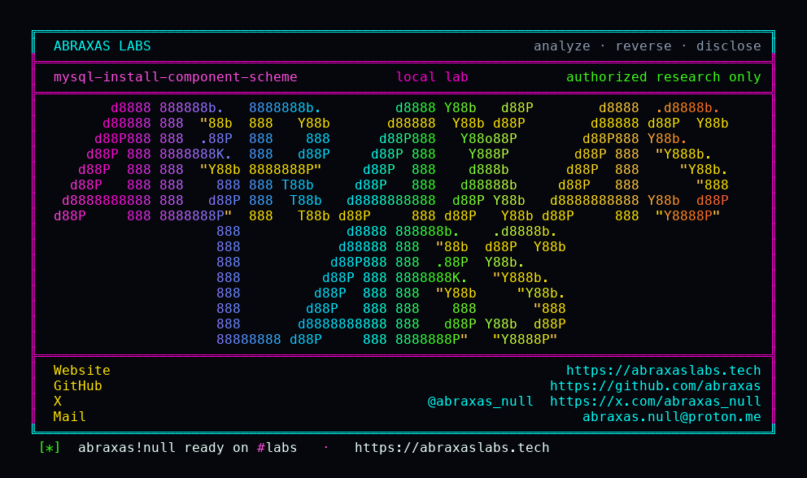

<p align="center">
  
</p>

<p align="center">
  <a href="https://abraxaslabs.tech"><strong>abraxaslabs.tech</strong></a>
  &nbsp;·&nbsp;
  <a href="https://github.com/abraxas">github.com/abraxas</a>
  &nbsp;·&nbsp;
  <a href="https://x.com/abraxas_null">@abraxas_null</a>
  &nbsp;·&nbsp;
  <a href="mailto:abraxas.null@proton.me">abraxas.null@proton.me</a>
  &nbsp;·&nbsp;
  <a href="https://github.com/abraxas/mysql-install-component-scheme">mysql-install-component-scheme</a>
</p>

# mysql-install-component-scheme

**Class:** RCE

**MySQL Community Server** `mysqld` `26.7.0` (`06a5c1c`) - Oracle

Default `file://` INSTALL COMPONENT is wrapped by `mysql_server_path_filter` and forced under `plugin_dir`. The unfiltered libminchassis loader stays registered as `dynamic_loader_scheme_file.mysql_minimal_chassis`. URN scheme `file.mysql_minimal_chassis` acquires that implementation and `dlopen`s an absolute path as the mysqld UID. INSTALL PLUGIN / CREATE FUNCTION SONAME still reject `/`. Needs INSERT on `mysql.component` (PR:H).

Lab copies stock `component_query_attributes.so` to `/tmp/MYSQL-INSTALL-COMPONENT-SCHEME-WITNESS.so`. No custom component.

| | |
|---|---|
| ID | no CVE yet |
| Class | **RCE** (component `dlopen` as mysqld; PR:H; lab loaded a stock `.so`) |
| CWE | [CWE-427](https://cwe.mitre.org/data/definitions/427.html) |
| CVSS | **High: 7.2** `CVSS:3.1/AV:N/AC:L/PR:H/UI:N/S:U/C:H/I:H/A:H` |
| Product | [MySQL Community Server](https://github.com/mysql/mysql-server) `mysqld` |
| Affected | **26.7.0** (`06a5c1c99c377fc41b2eba1ea244e8b220bdc3c8`) |
| Auth | INSTALL COMPONENT (INSERT on `mysql.component`) |
| License | [GNU Affero GPL v3.0](LICENSE) |
| Lab | `127.0.0.1` only. Stock unused component copied outside `plugin_dir`. |

## What an attacker can do

Hold INSTALL COMPONENT. Place a component `.so` outside `plugin_dir` (FILE DUMPFILE under `secure_file_priv`, or a local write). `INSTALL COMPONENT 'file.mysql_minimal_chassis:///abs/name'` (no `.so` suffix; the loader appends it). `dlopen` as the mysqld UID. The same URN is persisted in `mysql.component` and reloaded on restart.

`file:///abs/name` is denied (3529). `INSTALL PLUGIN ... SONAME '/abs/...'` is denied (1124). The qualified scheme is the leftover.

## How I found it

Same 26.7.0 hunt. `set_default("dynamic_loader_scheme_file.mysql_server_path_filter")` is the documented boundary. The unfiltered implementation stays registered so the wrapper can call it. `get_scheme_service_from_urn` takes the bytes before `://` as the scheme.

```c
my_service<SERVICE_TYPE(dynamic_loader_scheme)> service(
    (my_string("dynamic_loader_scheme_") + scheme).c_str(),
    &imp_mysql_minimal_chassis_registry);
```

`file.mysql_minimal_chassis` is a real scheme. `component.test` never tries it.

Wrong turns: 3-slash URN (`scheme:///tmp/...`) loaded; 4-slash was not needed. URN stem must omit `.so`.

## Lab

```bash
cd lab
./run.sh
```

Image `mysql:26.7.0`. Published `127.0.0.1:18650`. `plugin_dir=/usr/lib64/mysql/plugin`. Copy stock `component_query_attributes.so` to `/tmp/MYSQL-INSTALL-COMPONENT-SCHEME-WITNESS.so`.

```text
SUCCESS mysql-install-component-scheme file-slash-denied=yes qualified-load=yes component-urn=yes dump=26.7.0 image=mysql:26.7.0 MYSQL-INSTALL-COMPONENT-SCHEME-WITNESS
```

## The fix

Do not acquire `dynamic_loader_scheme_file.mysql_minimal_chassis` from SQL URNs. Map only `file` to the path-filter implementation. Reject a scheme that names an implementation. Keep `check_valid_path` on every file loader.

## References

- [github.com/mysql/mysql-server](https://github.com/mysql/mysql-server) tag [mysql-26.7.0](https://github.com/mysql/mysql-server/tree/mysql-26.7.0) (`06a5c1c99c377fc41b2eba1ea244e8b220bdc3c8`)
- [`components/libminchassis/dynamic_loader.cc`](https://github.com/mysql/mysql-server/blob/mysql-26.7.0/components/libminchassis/dynamic_loader.cc) `get_scheme_service_from_urn`
- [`sql/server_component/dynamic_loader_path_filter.cc`](https://github.com/mysql/mysql-server/blob/mysql-26.7.0/sql/server_component/dynamic_loader_path_filter.cc)
- Sibling packs: [abraxas/mysql-mysqldump-show-tables-overflow](https://github.com/abraxas/mysql-mysqldump-show-tables-overflow) · [abraxas/mysql-mysqldump-tab-path](https://github.com/abraxas/mysql-mysqldump-tab-path) · [abraxas/mysql-mysqlbinlog-raw-path](https://github.com/abraxas/mysql-mysqlbinlog-raw-path) · [abraxas/mysql-set-role-leftover](https://github.com/abraxas/mysql-set-role-leftover)
